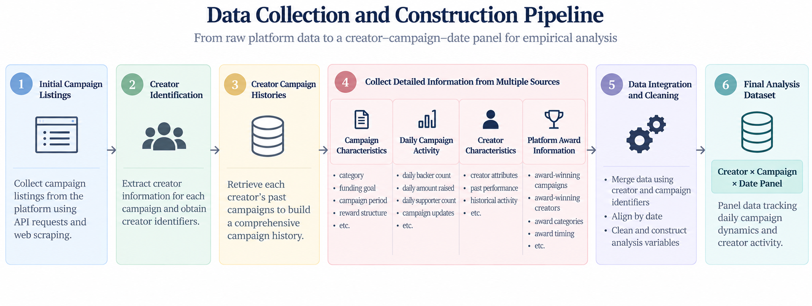

# Is It Still a U-shape?
## Empirical Study on the Dynamics of Reward-Based Crowdfunding with Award Effects

This project examines how platform awards, as observable quality signals, affect
backer behavior and funding dynamics in reward-based crowdfunding.

The study was presented at the **Workshop on e-Business (WeB) 2022**.

## Research Question
Prior research documents a U-shaped pattern in crowdfunding activity, with greater backer participation during the initial and ending stages of a campaign and lower activity during the middle stage.

This study examines whether this dynamic changes when uncertainty is reduced through a platform award.

1. **Does winning an award increase the number of daily backers in subsequent campaigns?**
2. **How does the award effect vary across the initial, middle, and ending stages of a campaign?**

## Data Collection
I constructed a panel dataset of reward-based crowdfunding campaigns on Wadiz, a major crowdfunding platform in South Korea, using Python.

The data collection pipeline combined API requests and web scraping to link campaign and creator information across multiple sources, including campaign histories, campaign characteristics, engagement measures, and award information.

**Tools:** Python, Requests, BeautifulSoup, Pandas, REST APIs, HTML Parsing

*The data collection code and raw dataset are not publicly distributed.*

## Data Preprocessing

The collected data were processed in three stages:

1. **Initial Data Processing** – Integration and cleaning of raw data collected
   from multiple sources.
2. **Supporter Panel Construction** – Construction of daily campaign activity
   measures from supporter-level data.
3. **Analysis Dataset Construction** – Integration of campaign, creator, award,
   and daily activity data into the final creator × campaign × date panel.

The preprocessing code is available in the
[`code/data_preprocessing/`](code/data_preprocessing/) directory.

## Empirical Strategy

The empirical analysis evaluates changes in crowdfunding activity following the announcement of the 2021 Wadiz Awards.

The analysis consists of three main steps:

1. **Propensity Score Matching (PSM)**  
   Match campaigns run by award-winning and non-award-winning creators using
   pre-treatment creator characteristics and historical campaign performance.

2. **Parallel Trends Assessment**  
   Compare pre-treatment trends in daily backer activity between the treatment
   and matched control groups.

3. **Difference-in-Differences (DiD)**  
   Estimate the effect of winning an award on subsequent daily backer activity,
   including heterogeneous effects across the initial, middle, and ending
   stages of the crowdfunding cycle.

The empirical analysis code is available in the
[`code/empirical_analysis/`](code/empirical_analysis/) directory.

## Key Findings

- Winning a platform award was associated with an increase of **more than 15%**
  in the average number of daily backers for subsequent crowdfunding campaigns.
- The award effect varied across the crowdfunding cycle.
- Relative to the ending stage, the award effect was approximately **9% larger
  in the initial stage** and **7% larger in the middle stage**.
- These results suggest that platform awards can mitigate the typical
  **"stuck-in-the-middle"** pattern observed in reward-based crowdfunding.

Overall, the findings suggest that observable quality signals can alter the
temporal dynamics of backer participation by reducing uncertainty.

## Presentation

[Workshop on e-Business (WeB) 2022 – Conference Presentation](research_outputs/WeB2022_presentation.pdf)
